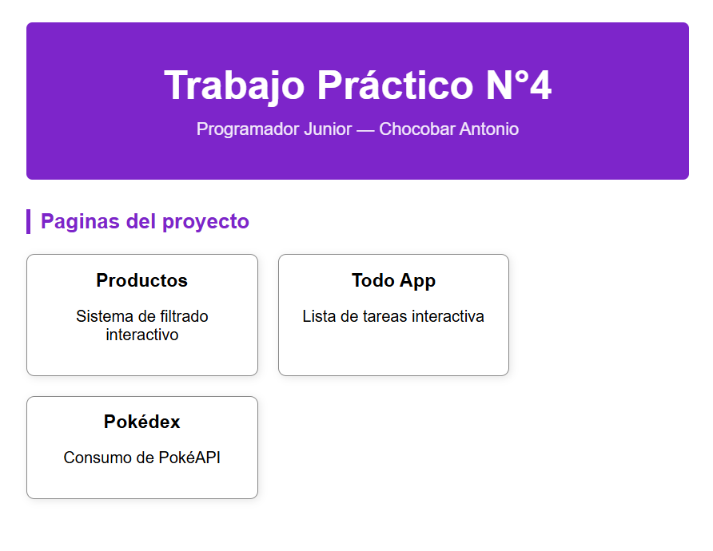
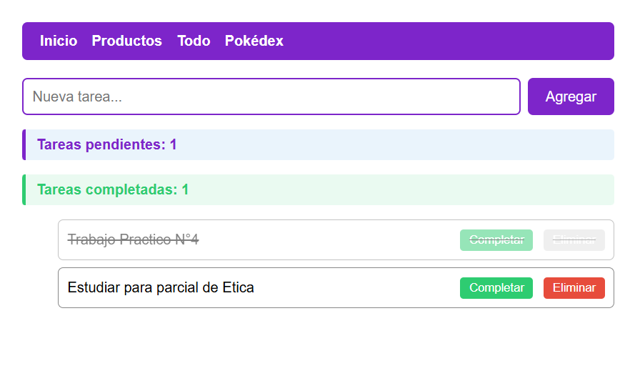
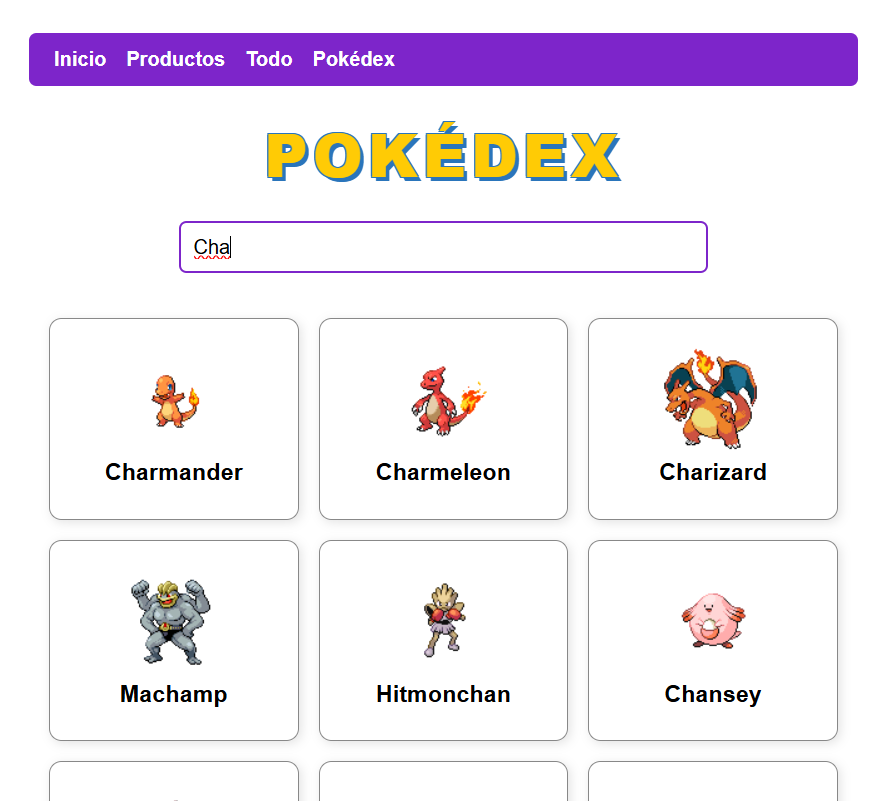

# Trabajo Práctico N°4

**Alumno:** Chocobar Antonio  
**Materia:** Prácticas Profesionalizantes II  

**Deploy:** [https://antony27c.github.io/Tp4-js/](https://antony27c.github.io/Tp4-js/)

---

## Capturas de pantalla

### Inicio


### Productos


### To-Do App


### Pokédex


---

## Tecnologías utilizadas

- HTML5
- CSS3 (variables CSS, Flexbox, Grid)
- JavaScript ES6+ (arrow functions, template literals, async/await)
- Fetch API
- PokéAPI

---

## Páginas del proyecto

### 1. `productos.html` — Sistema de filtrado de productos
Sistema interactivo de filtrado con un array de 8 productos. Permite filtrar por categoría, precio máximo, disponibilidad en stock y búsqueda por nombre en tiempo real. Todos los filtros funcionan de forma combinada.

**Funcionalidades:**
- Filtro por categoría con `<select>` y `.filter()`
- Filtro por precio máximo con `<input type="range">`
- Checkbox para mostrar solo productos en stock
- Búsqueda por nombre en tiempo real con `addEventListener("input")`
- Renderizado con `.map()` + `.innerHTML`

---

### 2. `todo.html` — Lista de tareas interactiva
Aplicación de To-Do list funcional con estilos profesionales y transiciones CSS.

**Funcionalidades:**
- Formulario con `preventDefault` + `createElement`
- Marcar tarea como completada con `classList.toggle("completada")` y tachado CSS
- Botón eliminar con `.remove()` (deshabilitado al completar)
- Botón dedicado para completar tarea
- Contador de tareas pendientes y completadas dinámico
- Validación: no se puede agregar una tarea vacía

---

### 3. `api-demo.html` — Pokédex con PokéAPI
Consume la [PokéAPI](https://pokeapi.co/) para mostrar pokémon como tarjetas con imagen y nombre.

**Funcionalidades:**
- Función `async` con `fetch()` a la API
- Verificación de `response.ok` antes de procesar
- `try/catch` para manejo de errores
- Estado "Cargando..." mientras espera la respuesta
- Renderizado con `.map()`
- Búsqueda dinámica por nombre o número
- Mensaje "No se encontraron resultados" si la búsqueda no arroja datos
- Mensaje de error visible si falla la red

---

## Estilos — `css/app.css`

Archivo CSS compartido para todas las páginas con:
- Variables CSS (`:root`) con paleta de colores coherente
- Layout responsive con Grid y Flexbox
- Tarjetas con sombras, border-radius y hover effect
- Estados visuales: loading, error, vacío
- Input de búsqueda estilizado con `:focus` visible
- Navegación con `<nav>` presente en todas las páginas

---

## Cómo usar

1. Clonar el repositorio:
```bash
git clone https://github.com/antony27c/Tp4-js.git
```
2. Abrir la carpeta en VS Code
3. Abrir `index.html` con **Live Server**

O accedé directamente al deploy: [https://antony27c.github.io/Tp4-js/](https://antony27c.github.io/Tp4-js/)

---

## Estructura del proyecto

```
Tp4-js/
├── api-demo.html
├── css/
│   └── app.css
├── index.html
├── js/
│   ├── api-demo.js
│   ├── ejercicios.js
│   ├── productos.js
│   └── todo.js
├── productos.html
├── screenshots/
│   ├── index.png
│   ├── pokedex.png
│   ├── productos.png
│   └── todo.png
└── todo.html
└──  README.md
```
